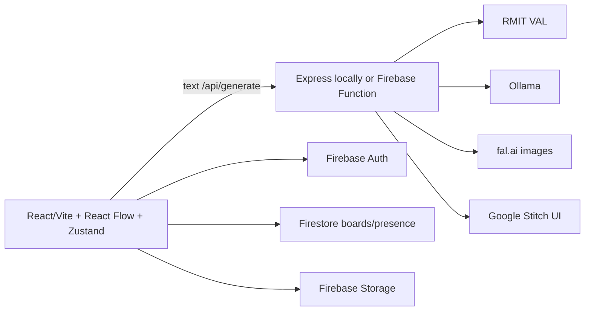
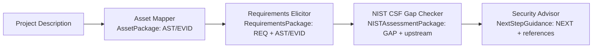
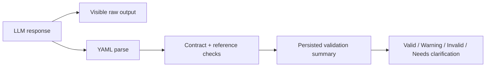

# Architecture

This document explains how AI Canva is structured. It's a **client-side, React Flow canvas** that
talks to a **Node backend** for AI generation and to **Firebase** for accounts, cloud storage,
and real-time collaboration.

## High-level overview



### Two backends

The same API surface exists in two places:

1. **`server/`** — an Express app for **local development**. It serves
   `/api/generate`, `/api/generate-image`, `/api/stitch-generate`, and `/api/health`. The Vite
   client proxies `/api` to it during dev.
2. **`functions/`** — the same endpoints packaged as a **Firebase Cloud Function** (`onRequest`)
   for **production** deployment (Firebase Hosting rewrites `/api/**` to it).

The API logic is duplicated across the two because Cloud Functions runs in the Firebase
environment while the local server runs in Node. Both use the same SDKs.

---

## Client

### State management — `store/boardStore.ts`

A [Zustand](https://zustand-demo.pmnd.rs/) store owns the board, with Firestore
persistence when signed in and localStorage for local/offline state:

- **`nodes` / `edges`** — the React Flow graph.
- **`boxData`** — a `Record<boxId, BoxData>` holding per-box content, prompts, status, output,
  images, slides, and generated code. This is kept **separate from the React Flow node objects**
  so it can be serialized to Firestore without extra graph fields.
- **`currentBoardId`, `boardTitle`, `saveStatus`, `boardList`, `collaborators`, `activeUsers`** —
  board metadata and collaboration state.

Key behaviors:

- **`runBox(id)`** is the orchestrator. It:
  1. Gathers upstream inputs from incoming edges (text + optional image).
  2. Builds a `NamedInput[]` (name + output) for prompt templating.
  3. Routes image and Stitch boxes to their services; text boxes use the selected
     `AI_PROVIDER` through the existing `/api/generate` contract (RMIT VAL or Ollama).
     Security boxes also enforce input and upstream validation gates.
  4. Updates the box's `status` (`idle → running → done | error`).
- **Debounced autosave**: every mutation calls `scheduleSave()`, which fires
  `saveToFirestore()` ~1s after the last change.
- **Real-time sync**: `subscribeToBoardUpdates()` sets up a Firestore `onSnapshot` on the board
  document plus a presence subcollection listener. Echo prevention compares the snapshot's
  `updatedAt` with the last locally-saved `updatedAt` to avoid re-applying your own writes.
- **Presence**: cursor moves are throttled to one write per 200ms into `boards/{id}/presence/{uid}`;
  entries older than 30s are filtered out, and presence is removed on page unload. A heartbeat
  re-stamps `lastActive` every 15s while a board is open, so online-but-idle users stay in the
  header roster (`PresenceRoster.tsx`) — a clickable avatar stack listing everyone on the board
  now, plus collaborators who are offline. Heartbeat-only users are skipped by the cursor overlay
  (`hasCursor: false`).

### Component tree

```
App.tsx                     Shell: header, board actions, sign-in, modals
├── ReactFlowProvider
│   ├── Canvas.tsx          ReactFlow graph + Background/Controls/MiniMap/Cursors
│   ├── Sidebar.tsx         "Add Box" panel grouped by category
│   └── Toolbar.tsx         In-canvas "How to use" help
├── NewBoardModal.tsx
└── ShareModal.tsx          Share link + collaborator management
```

- **`BoxNode.tsx`** is the single node component for **all** box types. It renders the header
  (icon + editable name), body (by type), footer (Run / settings / copy / save), and the
  settings panel (system prompt + prompt template + variable insertion). It uses
  `NodeResizer` for resize and React Flow `Handle`s for connections.

### Prompt templating — `lib/prompts.ts`

`fillPromptTemplate(template, inputs)` resolves variables in order:

1. `{{inputs}}` — all inputs, labeled by box name.
2. `{{input}}` — first input (backward compat).
3. `{{input_N}}` — Nth input, positional (backward compat).
4. `{{Box Name}}` — any remaining `{{...}}` matched (case-insensitive) against connected box names.

### Box definitions — `types.ts`

`BOX_TYPES: Record<BoxType, BoxTypeMeta>` is the source of truth for labels, colors,
roles and default prompts. `Canvas.tsx` derives normal `NODE_TYPES` and MiniMap colors
from it; `AreaNode` is the exception. `Sidebar.tsx` filters by role, including the
Security view. This view is discovery-only, not an authorization role.

### Code rendering — `lib/code.ts`

Generated React code is wrapped in a self-contained HTML file that loads React 18 + Babel via CDN
(`wrapCodeInHtml`), optionally with Tailwind + Google Fonts (`wrapUIInHtml` for the UI box),
then rendered in a sandboxed iframe. `extractCode` strips markdown code fences; `downloadHtml`
and `copyToClipboard` power the Save/Copy buttons.

### Firebase layer — `lib/`

- **`firebase.ts`** — initializes the app (config is hardcoded today; see OSS_READINESS).
- **`firestore.ts`** — CRUD + real-time subscriptions + presence + sharing for the `boards`
  collection and `presence` subcollection.
- **`storage.ts`** — uploads base64 images to Firebase Storage and returns a small fetchable URL.
- **`auth.ts`** — Google sign-in via popup and an auth-state listener.

---

## Backend

### Local Express server (`server/`)

`server/src/index.ts` sets up CORS, JSON body parsing (10 MB limit), four endpoints, and starts
the server on a detected free port (see `findPort.ts`). The actual port is written to
`.server-port` in the project root so the Vite proxy can target it.

Provider modules are created **lazily** (not at import time) because ES-module imports are
hoisted ahead of `dotenv.config()`:

- **`ollama.ts`** — `generateContent(systemPrompt, userPrompt)` calls Ollama's `/api/chat`
  endpoint. It targets **Ollama Cloud** at `https://ollama.com` by default (Bearer auth with
  `OLLAMA_API_KEY`), but respects `OLLAMA_HOST` so a local daemon also works. The model is set by
  `OLLAMA_MODEL` (default `deepseek-v4.1-flash`).
- **`provider.ts` / `val.ts`** — select Ollama by default or RMIT VAL with
  `AI_PROVIDER=val`; VAL uses chat/completions and `VAL_MODEL`. Secrets stay on the
  backend, and both providers return the same `content`, `model`, and `usage` shape.
- **`fal.ts`** — `generateCartoonImage({ prompt, imageUrl })`:
  - Image present → upload to fal storage (if base64), then `fal-ai/qwen-image-edit`
    (image-to-image).
  - No image → `fal-ai/flux/schnell` (text-to-image).
- **`stitch.ts`** — `generateStitchUI(prompt)` uses the Google Stitch SDK to create/reuse a
  project and generate a screen, then fetches and returns the HTML + screenshot URL. Prompts are
  capped (`MAX_PROMPT_CHARS`, default 6000) and use the fast `GEMINI_3_FLASH` model so real
  pipelines (large `{{inputs}}`) neither time out nor degrade into written specs.
- **`stitchJobs.ts`** *(functions only)* — the async job worker. Stitch generation is slow (40s+)
  and exceeds the ~60s Firebase Hosting rewrite timeout, so it runs on a Cloud Task queue. See
  `POST /api/stitch-generate` / `GET /api/stitch-status/:jobId` below.

### Firestore data model

Collection `boards/{boardId}`:

```
{
  title: string,
  ownerId: string,        // creator's Firebase UID
  ownerEmail: string,
  collaborators: string[],// emails invited by owner
  nodes: Node[],          // React Flow nodes
  edges: Edge[],
  boxData: Record<string, BoxData>,
  createdAt: number,
  updatedAt: number
}
```

Subcollection `boards/{boardId}/presence/{uid}`:

```
{ userId, email, displayName, initials, color, cursorX, cursorY, lastActive }
```

Collection `stitchJobs/{jobId}` *(production only, server-side)*:

```
{ status: "queued" | "running" | "done" | "error", prompt, html?, imageUrl?, error?, createdAt, updatedAt? }
```

---

## Data flow for a "Run"

1. User clicks **▶ Run** on a box.
2. `runBox(id)` reads `edges` for incoming connections and collects `NamedInput`s (and an image,
   if an upstream Image box is connected).
3. The prompt is filled with `fillPromptTemplate`, and the request goes to the backend
   (`/api/generate`, `/api/generate-image`, or `/api/stitch-generate`).
4. The backend calls the relevant AI SDK and returns a result. **Stitch is asynchronous**: the
   server returns a `jobId` immediately, the client polls `GET /api/stitch-status/:jobId` until
   the job is `done`/`error`, then receives the HTML. (A synchronous Stitch round-trip exceeded the
   ~60s Firebase Hosting rewrite timeout, so the deployed box reported "Request failed" even though
   the screen was created in Stitch.)
5. `runBox` post-processes it (parse slides JSON, extract code, etc.) and writes it into
   `boxData` with `status: "done"`.
6. `scheduleSave()` triggers a debounced Firestore write; collaborators see it via `onSnapshot`.

### Workshops (facilitators, teams, guests)

A permission layer parallel to admins: `facilitators/{uid}` docs (granted via the admin
`/api/admin/roles` endpoint). The Facilitator Dashboard (admins + facilitators) manages
**workshops** (`workshops/{id}`), **template boards** (ordinary boards flagged `isTemplate`,
copied when a team is created), and **teams** (`teams/{id}`, max 5 seats, facilitator-created).
Each seat is a code at top-level `codes/{code}`; the `/api/workshop/join` Cloud Function redeems a
code for a Firebase **custom token** bound to a durable per-code guest uid — guests join without
login, pick a name, land on their team board (via the board's `memberUids`), and can create their
own boards. The local dev server proxies the join endpoint to the deployed function.

## Security Engineering workflow



`boardTemplates.ts` creates this five-box, four-edge board but never runs AI boxes.
`boardStore.ts` fills `{{inputs}}`, checks required input and invalid upstream status,
then sends the user-triggered generation request. `securityArtifacts.ts` parses YAML,
checks canonical artifact type/schema, required fields and references, and persists a
validation summary alongside the unchanged raw `boxData.output`. Invalid upstream
artifacts block the next security generation; warnings are visible but do not
automatically block. `clarification_required` is a structurally valid request for
human information; it is not the same as `invalid`.



For NIST, `applicationAssessmentDate()` supplies runtime `assessment_date` in the
prompt; validation compares the output date against that trusted value. A model's
own historical date is not trusted. Structural validity does not prove that a CIA
impact or NIST mapping is correct. Human review remains mandatory.

## Text API routing and demo boundary

`client/src/lib/apiTarget.ts` resolves text generation in this order: valid runtime
localStorage override, then public `VITE_AI_API_BASE_URL` build configuration,
then `/api/generate`. Only text generation uses this override. Normal Firebase
Hosting rewrites `/api/**` to Functions; local Vite proxies it to Express.
`scripts/deploy-demo-preview.sh` embeds a temporary Cloudflare Quick Tunnel URL
in a Firebase Preview build after checking `/api/health`; the tunnel reaches the
local Express backend and its backend-only provider key. Firebase Auth, Firestore,
and Storage remain on Firebase. This route is for supervised demos, not production.
